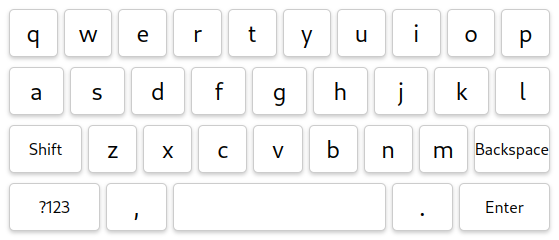

# teclado.js


<p align="center">
  
</p>

Simple virtual keyboard inspired by mobile keyboards.

- No external dependencies
- Light-weight, <4kb gzipped size
- Written in TypeScript

📖 [Documentation](https://eduhds.github.io/teclado.js)
|
🌐 [Live example](https://codesandbox.io/p/sandbox/teclado-js-example-474h93?layout=%257B%2522sidebarPanel%2522%253A%2522EXPLORER%2522%252C%2522rootPanelGroup%2522%253A%257B%2522direction%2522%253A%2522horizontal%2522%252C%2522contentType%2522%253A%2522UNKNOWN%2522%252C%2522type%2522%253A%2522PANEL_GROUP%2522%252C%2522id%2522%253A%2522ROOT_LAYOUT%2522%252C%2522panels%2522%253A%255B%257B%2522type%2522%253A%2522PANEL_GROUP%2522%252C%2522contentType%2522%253A%2522UNKNOWN%2522%252C%2522direction%2522%253A%2522vertical%2522%252C%2522id%2522%253A%2522clvs5oa7r00062v6hcqhx5qps%2522%252C%2522sizes%2522%253A%255B100%252C0%255D%252C%2522panels%2522%253A%255B%257B%2522type%2522%253A%2522PANEL_GROUP%2522%252C%2522contentType%2522%253A%2522EDITOR%2522%252C%2522direction%2522%253A%2522horizontal%2522%252C%2522id%2522%253A%2522EDITOR%2522%252C%2522panels%2522%253A%255B%257B%2522type%2522%253A%2522PANEL%2522%252C%2522contentType%2522%253A%2522EDITOR%2522%252C%2522id%2522%253A%2522clvs5oa7q00022v6hj78oloko%2522%257D%255D%257D%252C%257B%2522type%2522%253A%2522PANEL_GROUP%2522%252C%2522contentType%2522%253A%2522SHELLS%2522%252C%2522direction%2522%253A%2522horizontal%2522%252C%2522id%2522%253A%2522SHELLS%2522%252C%2522panels%2522%253A%255B%257B%2522type%2522%253A%2522PANEL%2522%252C%2522contentType%2522%253A%2522SHELLS%2522%252C%2522id%2522%253A%2522clvs5oa7q00032v6hug52obzo%2522%257D%255D%252C%2522sizes%2522%253A%255B100%255D%257D%255D%257D%252C%257B%2522type%2522%253A%2522PANEL_GROUP%2522%252C%2522contentType%2522%253A%2522DEVTOOLS%2522%252C%2522direction%2522%253A%2522vertical%2522%252C%2522id%2522%253A%2522DEVTOOLS%2522%252C%2522panels%2522%253A%255B%257B%2522type%2522%253A%2522PANEL%2522%252C%2522contentType%2522%253A%2522DEVTOOLS%2522%252C%2522id%2522%253A%2522clvs5oa7q00052v6hls80qtud%2522%257D%255D%252C%2522sizes%2522%253A%255B100%255D%257D%255D%252C%2522sizes%2522%253A%255B40%252C60%255D%257D%252C%2522tabbedPanels%2522%253A%257B%2522clvs5oa7q00022v6hj78oloko%2522%253A%257B%2522id%2522%253A%2522clvs5oa7q00022v6hj78oloko%2522%252C%2522tabs%2522%253A%255B%257B%2522id%2522%253A%2522clvs5qw1t006k2v6ha5o8p5lz%2522%252C%2522mode%2522%253A%2522permanent%2522%252C%2522type%2522%253A%2522FILE%2522%252C%2522initialSelections%2522%253A%255B%257B%2522startLineNumber%2522%253A9%252C%2522startColumn%2522%253A10%252C%2522endLineNumber%2522%253A9%252C%2522endColumn%2522%253A10%257D%255D%252C%2522filepath%2522%253A%2522%252Findex.html%2522%252C%2522state%2522%253A%2522IDLE%2522%257D%255D%252C%2522activeTabId%2522%253A%2522clvs5qw1t006k2v6ha5o8p5lz%2522%257D%252C%2522clvs5oa7q00052v6hls80qtud%2522%253A%257B%2522tabs%2522%253A%255B%257B%2522id%2522%253A%2522clvs5oa7q00042v6hd0eto4nc%2522%252C%2522mode%2522%253A%2522permanent%2522%252C%2522type%2522%253A%2522UNASSIGNED_PORT%2522%252C%2522port%2522%253A0%252C%2522path%2522%253A%2522%252F%2522%257D%255D%252C%2522id%2522%253A%2522clvs5oa7q00052v6hls80qtud%2522%252C%2522activeTabId%2522%253A%2522clvs5oa7q00042v6hd0eto4nc%2522%257D%252C%2522clvs5oa7q00032v6hug52obzo%2522%253A%257B%2522tabs%2522%253A%255B%255D%252C%2522id%2522%253A%2522clvs5oa7q00032v6hug52obzo%2522%257D%257D%252C%2522showDevtools%2522%253Atrue%252C%2522showShells%2522%253Afalse%252C%2522showSidebar%2522%253Atrue%252C%2522sidebarPanelSize%2522%253A15%257D)

## Install

```sh
npm i teclado.js
```

Or

```sh
yarn add teclado.js
```

Or

```sh
pnpm add teclado.js
```

## Usage

```html
<input type="text" id="inputId" />
```

```javascript
import { teclado } from 'teclado.js';

var kb = teclado();

kb.on('inputId', {
  onChange: value => {
    document.getElementById('inputId').value = value;
  }
});
```

## Support

[](https://www.buymeacoffee.com/eduhds)
[](https://ko-fi.com/eduhds)
